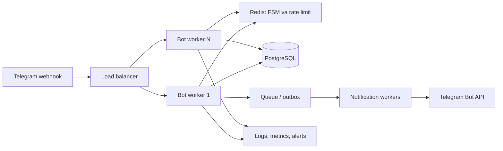

# Tanishuv bot — bajarilgan ishlar hisoboti

Hisobot sanasi: 2026-09-18

## Bajarilgan o‘zgarishlar

### 1. Interfeys rus tiliga o‘tkazildi

Foydalanuvchiga ko‘rinadigan matnlar `bot/texts.py` faylida rus tiliga tarjima qilindi:

- boshlang‘ich xabar;
- 18+ va maxfiylikka rozilik matni;
- maxfiylik siyosati;
- yordam matni va komandalar tavsifi;
- username qo‘shish bo‘yicha ko‘rsatma;
- anketani o‘chirishdan oldingi ogohlantirish;
- bosh menyuning oltita tugmasi.

Yangi bosh menyu:

- `🔎 Смотреть анкеты`
- `👤 Моя анкета`
- `❤️ Мне поставили лайк`
- `🤝 Мои взаимные симпатии`
- `⚙️ Настройки поиска`
- `❓ Помощь`

Eski o‘zbekcha reply-tugmalar ham vaqtincha qabul qilinadi. Shu sababli foydalanuvchi chatida qolib ketgan eski menyuni bosganda ham bot ishlaydi. `/start` yuborilganda yangi ruscha menyu chiqadi.

### 2. Demo anketalar (olib tashlangan)

Sinov uchun 30 ta faol, sun’iy demo anketa yaratilgan edi. Keyin ular kerak emasligi aniqlangach, 2026-09-18 kuni barchasi bazadan olib tashlandi:

| Toifa | Olib tashlangan soni | Qidiruv parametri | Shahar |
| --- | ---: | --- | --- |
| Qizlar | 20 | Erkaklarni qidiradi | `osh` |
| O‘g‘il bolalar | 10 | Qizlarni qidiradi | `osh` |

Ular bilan bog‘liq reaction, match, block va report yozuvlari ham tekshirildi; mavjud bo‘lgan bitta reaction o‘chirildi. Real foydalanuvchilar va real profillar o‘zgartirilmadi.

Demo ma’lumotlarini qayta qo‘shuvchi skript ham olib tashlandi.

### 3. Demo rasmlar (olib tashlangan)

Ikki sun’iy portret yaratilgan va demo anketalarda ishlatilgan edi. Demo anketalar o‘chirilgach, ushbu rasmlar ham olib tashlandi.

Bot faqat ro‘yxatdan o‘tishda Telegram bergan haqiqiy `file_id` bilan ishlaydi.

## Bot funksiyalari

### Geolokatsiya bo‘yicha qidiruv

- Yangi foydalanuvchi shahar nomini yozmaydi, Telegram’dagi `📍 Отправить геолокацию` tugmasi bilan lokatsiyasini yuboradi.
- Kenglik va uzunlik koordinatalari lokal bazada saqlanadi; aniq koordinatalar boshqa foydalanuvchilarga ko‘rsatilmaydi.
- Mos anketalar Haversine formulasi bilan hisoblangan masofa bo‘yicha yaqinidan uzoqqa saralanadi.
- Maxsus radius yo‘q: yaqin profil bo‘lmasa, keyingi uzoqroq profil chiqadi.
- `👤 Моя анкета → 📍 Местоположение` va `⚙️ Настройки поиска → 📍 Изменить геолокацию` orqali lokatsiyani yangilash mumkin.
- Eski profillar migratsiyadan keyin saqlanadi, lekin geolokatsiya yuborilgach yangi qidiruvga qo‘shiladi.
- `0002` Alembic migratsiyasi koordinata ustunlarini real bazaga qo‘shadi.
- Bot ishga tushishida migratsiya raqami endi qo‘lda yozilmaydi: Alembic’dagi eng so‘nggi versiya avtomatik tekshiriladi. Shu sabab keyingi migratsiyalarda `База данных не готова` xatosi eski `0001` raqami sababli chiqmaydi.

### Ro‘yxatdan o‘tish

- `/start` orqali ro‘yxatdan o‘tish boshlanadi.
- 18+ tasdig‘i va ma’lumotlarni qayta ishlashga rozilik olinadi.
- Telegram username talab qilinadi.
- Ism, yosh, jins, qidirilayotgan jins, shahar, tavsif va bitta foto so‘raladi.
- Yosh 18–99 oralig‘ida bo‘lishi kerak.
- Ism, shahar va tavsifda `@username` hamda havolalar bloklanadi.
- Tayyor anketa tasdiqlangandan keyingina bazaga yoziladi.
- `/cancel` tugallanmagan ro‘yxatdan o‘tishni bekor qiladi.

### Anketalar va qidiruv

- `🔎 Смотреть анкеты` mos anketalarni navbatma-navbat ko‘rsatadi.
- Har bir anketada `Нравится`, `Пропустить`, `Заблокировать` va `Пожаловаться` tugmalari bor.
- Moslik yoshi, jinsi, qidiruv parametrlari, shahri, bloklar va oldingi qarorlar bo‘yicha tekshiriladi.
- Bir soniyalik like/pass cheklovi takroriy tez bosishni oldini oladi.
- `❤️ Мне поставили лайк` hali javob berilmagan kiruvchi layklarni ko‘rsatadi.

### O‘zaro simpatiya va kontakt

- Ikki foydalanuvchi bir-biriga like bersa, bitta o‘zaro simpatiya yaratiladi.
- `🤝 Мои взаимные симпатии` o‘zaro simpatiyalarni beshtadan sahifalab ko‘rsatadi.
- `Показать контакт` tugmasi boshqa foydalanuvchining joriy Telegram username manzilini tekshiradi va `https://t.me/...` havolasini beradi.
- Kontakt ochilishidan oldin ban, blok, profil mavjudligi va username qayta tekshiriladi.

Demo foydalanuvchilarning Telegram akkaunti yo‘q. Shuning uchun ular bilan o‘zaro simpatiya yaratilsa ham, ular uchun haqiqiy Telegram kontakt havolasi ochilmaydi. Bu demo ma’lumotlar uchun kutilgan holat.

### Mening anketam va qidiruv sozlamalari

- `👤 Моя анкета` ism, yosh, shahar, jins, kim qidirilayotgani, tavsif va rasmni tahrirlash imkonini beradi.
- Anketani yashirish yoki yana ko‘rsatish mumkin.
- `/delete` profil, layklar va o‘zaro simpatiyalarni tasdiq bilan o‘chiradi.
- `⚙️ Настройки поиска` yosh oralig‘i, faqat o‘z shahri yoki barcha shaharlar va qidiriladigan jinsni o‘zgartiradi.

### Xavfsizlik va moderatsiya

- Foydalanuvchini bloklash bot ichidagi ko‘rinish va kontaktni cheklaydi.
- Shikoyat sabablari: spam, soxta anketa, nomaqbul kontent yoki boshqa sabab.
- Shikoyat yuborilganda nishon foydalanuvchi shikoyatchi uchun bloklanadi.
- Shikoyatchi kimligi shikoyat qilingan odamga berilmaydi.
- Banlangan foydalanuvchida `/help`, `/privacy`, `/id` va `/delete` ishlashda davom etadi.

### Administrator funksiyalari

- `/admin` umumiy statistika va ochiq shikoyatlarni ko‘rsatadi.
- `/ban Telegram_ID` foydalanuvchini bloklaydi.
- `/unban Telegram_ID` blokni olib tashlaydi.
- Administrator shikoyatni ochishi, foydalanuvchini ban/unban qilishi va shikoyatni ko‘rib chiqilgan deb belgilashi mumkin.
- Administrator huquqi `.env` faylidagi `ADMIN_IDS` qiymati bilan tekshiriladi.

## Loglardagi holatlar

### `Временная ошибка связи с Telegram`

Bu Telegram API bilan vaqtinchalik tarmoq muammosi. Bot polling mexanizmi bunday xatoda qayta ulanishga urinadi. Internet aloqasi barqaror bo‘lishi va Telegram API’ga chiqish mavjud bo‘lishi kerak.

### `Telegram отклонил запрос; повторной отправки не было`

Bu odatda eski yoki qayta bosilgan inline tugmada Telegram avvalgi xabar klaviaturasini o‘zgartirishni qabul qilmaganda chiqadi. Masalan, tugma allaqachon o‘chirilgan bo‘lishi mumkin. Bu holatda bot bazadagi qarorni takror yaratmaydi.

2026-09-18 dagi real tekshiruvda asosiy profilning saqlangan Telegram `file_id`i ham yaroqsiz yoki vaqtincha mavjud emasligi aniqlandi. Bot endi bunday holatda xato bilan to‘xtamaydi: `Моя анкета` fotosiz ochiladi va `Фото` tugmasi orqali yangi rasm yuklashni taklif qiladi. Yangi rasm yuborilgach, Telegram bergan yangi `file_id` bazaga saqlanadi.

### `С этим токеном уже работает другой процесс опроса`

Bitta `BOT_TOKEN` bilan faqat bitta `python -m bot.main` jarayoni ishlashi mumkin. Xato ikkinchi nusxa ishga tushirilganda yuz beradi. Agent ishga tushirgan nusxa to‘xtatildi. Endi botni faqat bitta terminal yoki PyCharm konfiguratsiyasidan ishga tushiring:

```sh
source .venv/bin/activate
python -m bot.main
```

To‘xtatish uchun `Ctrl+C` bosing.

## Tekshiruv natijalari

- `pytest -q`: **48 passed**.
- `ruff check scripts`: **All checks passed**.
- Demo profillar bazadan olib tashlandi: **0 ta demo profil qoldi**.

## 10 ming va 100 ming foydalanuvchiga o‘sish bahosi

### Hozirgi holat

Telegram reply-klaviaturasidagi `🔎 Смотреть анкеты`, `🤝 Мои взаимные симпатии` kabi yozuvlar tugma bosilganda foydalanuvchi nomidan chatga yuboriladi. Bu Telegram’ning odatiy xatti-harakati, xatolik emas. Bot undan keyin tegishli javobni yuboradi.

`Временная ошибка связи с Telegram` xabari esa Telegram API bilan tarmoq aloqasi uzilgan yoki vaqtincha javob bermaganini anglatadi. Shu paytda botning javobi kechikishi yoki yuborilmasligi mumkin. Bu internet yoki Telegram API bilan bog‘liq operatsion muammo bo‘lib, foydalanuvchilar sonidan mustaqil ravishda ham sodir bo‘lishi mumkin.

### 10 000 foydalanuvchi

10 000 ta **ro‘yxatdan o‘tgan**, lekin bir vaqtda kam faol foydalanuvchi uchun hozirgi baza hajmi yetadi. Ammo buni production darajasida ishonchli deb bo‘lmaydi:

- bot faqat bitta long-polling processida ishlaydi;
- update’lar ketma-ket qayta ishlanadi (`handle_as_tasks=False`);
- SQLite yozuvlari bitta process ichidagi `asyncio.Lock` orqali navbatga qo‘yiladi;
- formalar va like cooldown `MemoryStorage`da turadi, restartda yo‘qoladi;
- qidiruv so‘rovi mos profilni topish uchun bir nechta `EXISTS` tekshiruvlarini bajaradi;
- monitoring, metrika, navbat va xabarlarni qayta yuborish mexanizmi yo‘q.

Shuning uchun 10 000 foydalanuvchiga chiqishdan oldin quyidagi ishlar bajarilishi kerak:

1. SQLite o‘rniga PostgreSQL ishlatish.
2. FSM va rate limit uchun Redis qo‘shish.
3. Qidiruv, reaction, block va match so‘rovlariga `EXPLAIN ANALYZE` asosida composite indekslar qo‘shish.
4. Telegram API xatolarining sababini, kodini va methodini token yoki profil matnisiz loglash.
5. Sentry yoki o‘xshash xatolik kuzatuvi, health-check va metrikalarni qo‘shish.
6. K6/Locust orqali haqiqiy yuklama testi o‘tkazish.

### 100 000 foydalanuvchi

Hozirgi arxitektura 100 000 foydalanuvchi uchun mo‘ljallanmagan. 100 000 ta umumiy profil SQLite fayliga sig‘ishi mumkin, biroq haqiqiy trafik, parallel tugma bosish, notification va qidiruv yuklamasi uchun bitta SQLite fayli va bitta bot processi yetmaydi.

100 000 foydalanuvchi uchun kerak bo‘ladigan arxitektura:



Muhim o‘zgarishlar:

- long polling o‘rniga webhook;
- bir nechta stateless worker;
- PostgreSQL tranzaksiyalari va mos indekslar;
- Redis’da umumiy FSM, cooldown va rate limit;
- notification uchun outbox jadvali hamda queue worker;
- media fayllar uchun object storage yoki Telegram `file_id` strategiyasi;
- backup, monitoring, alert va deploy rollback;
- spam himoyasi, CAPTCHA/verification, moderatorlar uchun audit log.

Xulosa: hozirgi MVP demo va kichik auditoriya uchun yaxshi. 10 000 foydalanuvchi oldidan optimizatsiya va PostgreSQL/Redis migratsiyasi boshlanishi kerak. 100 000 foydalanuvchi uchun esa yuqoridagi production arxitekturasini alohida bosqichda joriy qilish zarur.

## Asosiy fayllar

| Fayl | Vazifasi |
| --- | --- |
| `bot/texts.py` | Barcha asosiy ko‘rinadigan matnlar va menyu nomlari |
| `bot/keyboards/common.py` | Inline va reply klaviaturalar |
| `bot/handlers/registration.py` | Ro‘yxatdan o‘tish oqimi |
| `bot/handlers/discovery.py` | Anketalarni qidirish va like/pass |
| `bot/handlers/matches.py` | O‘zaro simpatiyalar va kontakt |
| `bot/handlers/profile.py` | Profil va qidiruv sozlamalari |
| `bot/handlers/moderation.py` | Bloklash va shikoyatlar |
| `bot/handlers/admin.py` | Administrator funksiyalari |
| `bot/services/store.py` | Bazadagi biznes qoidalari |
| `bot/services/telegram.py` | Telegram xabarlari va kontakt |
